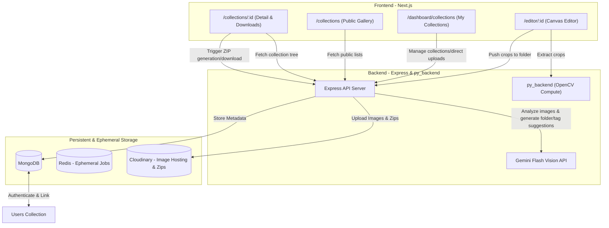

# Feature Request: Public Collections & Asset Community Hub

This document specifies the requirements, architectural design, data schemas, API routes, and user experience flows for the **Public Collections & Community Hub** feature in `open_assets`.

---

## 1. Executive Summary

`open_assets` is an AI-powered asset extraction tool that helps users isolate individual assets (sprite sheets, UI kits, icon packs) using OpenCV. Currently, isolated assets are ephemeral (24-hour TTL in Redis) and exported only as ZIP downloads.

This feature introduces a **Public Collections & Community Hub** that enables users to organize extracted or uploaded assets into permanent, structured folders inside public collections. These collections can be shared with, searched by, and downloaded by the community, creating a thriving asset-sharing ecosystem.

---

## 2. User Journey & Use Cases

### User Persona A: The Creator (Publisher)
- **Direct Uploads**: Creates a new collection (e.g., "Retro RPG Assets"), sets up folders (e.g., "Characters", "Items", "Tiles"), and uploads images directly from their device.
- **Extraction-to-Collection Pipeline**: After extracting assets on the canvas editor page, instead of downloading a transient ZIP, the user clicks **"Export to Collection"**, chooses/creates a collection, selects a folder, and pushes the extracted crops directly.
- **AI Folder/Asset Naming**: Receives AI-powered recommendations for folder names and asset tags based on Gemini Flash Vision's analysis of the uploaded/cropped image data.

### User Persona B: The Consumer (Downloader)
- **Discovery**: Browses `/collections` to discover asset packs, filtering by category, popularity (likes/downloads), or searching via keywords.
- **Granular Downloading**: Navigates the single-level folder tree on `/collections/:id` and downloads:
  - An individual cropped image.
  - A specific folder (e.g., just the "Icons" folder) zipped on-the-fly.
  - The entire collection as a consolidated structured ZIP file.

---

## 3. System Architecture & Data Flow



---

## 4. Persistent Data Model (MongoDB)

Since public collections must be permanent, metadata is stored in MongoDB, referencing the user profiles. The images themselves are hosted on Cloudinary.

### 4.1. `Collection` Schema
```typescript
interface ICollection extends Document {
  creator: mongoose.Schema.Types.ObjectId; // Reference to User
  name: string;
  description?: string;
  isPublic: boolean;
  likesCount: number;
  downloadCount: number;
  tags: string[]; // Aggregated search tags
  createdAt: Date;
  updatedAt: Date;
}
```

### 4.2. `Folder` Schema
```typescript
interface IFolder extends Document {
  collectionId: mongoose.Schema.Types.ObjectId; // Reference to Collection
  name: string;
  description?: string;
  tags: string[]; // Suggested or user-defined tags
  createdAt: Date;
  updatedAt: Date;
}
```

### 4.3. `Image` Schema
```typescript
interface IImage extends Document {
  folderId: mongoose.Schema.Types.ObjectId; // Reference to Folder
  collectionId: mongoose.Schema.Types.ObjectId; // Denormalized for quick collection-level queries
  name: string;
  cloudinaryUrl: string;
  cloudinaryPublicId: string;
  width?: number;
  height?: number;
  sizeBytes?: number;
  tags: string[]; // Gemini auto-generated + user-defined tags
  geminiMetadata?: {
    description?: string;
    dominantColors?: string[];
    labels?: string[];
  };
  createdAt: Date;
}
```

---

## 5. API Endpoints Specification

### 5.1. Collection Management
- **`GET /api/collections`**
  - **Description**: Returns a paginated list of public collections with search queries, tag filters, and sorting (by `likesCount`, `downloadCount`, or `createdAt`).
  - **Auth**: None (Public).

- **`POST /api/collections`**
  - **Description**: Create a new empty collection.
  - **Auth**: Required.
  - **Body**: `{ name: string, description?: string, isPublic: boolean }`

- **`GET /api/collections/:id`**
  - **Description**: Retrieve a collection with its folder structure and nested images.
  - **Auth**: None (Public, unless the collection is private/draft, then owner-only).

- **`PUT /api/collections/:id`**
  - **Description**: Update metadata or visibility of a collection.
  - **Auth**: Required (Owner only).

- **`DELETE /api/collections/:id`**
  - **Description**: Delete a collection and its folders/images (including deleting files from Cloudinary).
  - **Auth**: Required (Owner or Admin only).

### 5.2. Folders & Assets Ingestion
- **`POST /api/collections/:id/folders`**
  - **Description**: Create a folder within a collection.
  - **Auth**: Required (Owner only).
  - **Body**: `{ name: string, description?: string }`

- **`POST /api/collections/:id/folders/:folderId/images`**
  - **Description**: Upload a new image or push multiple cropped images into a folder.
  - **Auth**: Required (Owner only).
  - **Body**: Supports two modes:
    1. **Direct Upload**: Multipart/form-data for file uploads.
    2. **Editor Export**: Pushes cropped bounding box coordinates + original image ref, triggers backend crop, uploads crops to Cloudinary, and associates with the folder.
  - **Gemini Integration**: Inside this route, image data is sent to the Gemini Flash Vision API to auto-generate labels, tags, and suggested folder structures/names if applicable.

- **`DELETE /api/collections/:id/folders/:folderId/images/:imageId`**
  - **Description**: Remove an image from a folder.
  - **Auth**: Required (Owner only).

### 5.3. Downloads & Interactions
- **`POST /api/collections/:id/like`**
  - **Description**: Upvote/like a collection. Increments `likesCount`.
  - **Auth**: Required.

- **`GET /api/collections/:id/download`**
  - **Description**: Download the entire collection as a structured ZIP. The backend triggers the Cloudinary Archive API or Node.js `archiver` to fetch all images in all folders and build a ZIP with folder subdirectories:
    ```
    Collection-Name.zip
    ├── Folder-A/
    │   ├── Asset-1.png
    │   └── Asset-2.png
    └── Folder-B/
        ├── Asset-3.png
        └── Asset-4.png
    ```
  - **Auth**: None. Increments `downloadCount`.

- **`GET /api/collections/:id/folders/:folderId/download`**
  - **Description**: Download a single folder's images as a flat ZIP.
  - **Auth**: None.

---

## 6. AI Integration & Gemini Enhancement

When images are added to a folder, the backend runs an asynchronous background job to enrich the asset:
1. **Vision Inspection**: Sends the image to the `Gemini Flash` Vision endpoint.
2. **Contextual Tagging**: Generates context-aware tags (e.g., `"pixel-art"`, `"fantasy"`, `"ui-button"`, `"character-sprite"`).
3. **Smart Renaming & Alt Text**: Replaces generic filenames (like `crop_3.png`) with descriptive names (e.g., `golden-chest-closed.png`) and writes accessibility alt text.
4. **Folder Classification**: If the user pushes multiple unclassified crops, Gemini analyzes the group and suggests category folder divisions (e.g., grouping weapon-like assets into a "Weapons" folder).

---

## 7. Frontend User Experience & Routes

Modern vanilla-CSS styled layouts with rich micro-animations, glassmorphism containers, and smooth transitions will be implemented.

### 7.1. `/collections` (Public Gallery)
- **Visuals**: Modern, responsive grid of card components. Cards display collection cover sheets (auto-collaged from folder images), title, author badge, like/download stats, and tag chips.
- **Controls**: Premium real-time search input and tag selectors. Smooth CSS scale-up micro-animations on hover.

### 7.2. `/collections/:id` (Interactive Pack Page)
- **Visuals**: Split-screen or layout with a beautiful sticky sidebar displaying collection details, download counters, and action buttons ("Download Whole Pack").
- **Asset Tree**: Folders are structured in collapsible accordions. Inside each folder, a grid displays high-quality thumbnails of the assets.
- **Asset Preview Modal**: Clicking any image opens a premium blur-background light-box displaying:
  - Zoomable asset preview.
  - Image details (resolution, size, filetype).
  - Gemini AI description and auto-tags.
  - "Download This File" button.

### 7.3. `/dashboard/collections` (Asset Manager)
- **Visuals**: A private, elegant workspace.
- **Capabilities**: Drag-and-drop file uploaders with file upload progress rings, creation modals, editable fields for descriptions, and tag-management interfaces.

### 7.4. Canvas Editor Integration
- **Interaction**: In `/editor/:id`, next to the "Export ZIP" button, a new primary CTA **"Export to Public Collection"** is added.
- **Workflow**:
  1. Opens a side-drawer or modal.
  2. The user selects from their existing collections, or types a name to create a new one on-the-fly.
  3. The user picks or creates a destination folder.
  4. Clicks "Save & Publish" -> Backend processes the crops, uploads to Cloudinary, runs Gemini tagging, and saves it persistently to the database.

---

## 8. Verification & QA Plan

### 8.1. Automated Unit & Integration Tests
- **MongoDB Schema Tests**: Verify collections, folders, and images create, link, and validate correctly.
- **API Endpoint Tests**:
  - Test authentication guards (guests cannot edit or delete collections).
  - Test download controllers (`GET /collections/:id/download` successfully yields a valid structured zip).
  - Mock Gemini Flash responses to test auto-tagging pipelines.

### 8.2. Manual Verification Checklist
- [ ] Create a collection via `/dashboard/collections` and confirm it appears in `/collections`.
- [ ] Upload multiple images directly to a folder and verify that the Gemini API enriches the metadata (tags, name).
- [ ] Perform a crop on the `/editor/:id` canvas and successfully export the isolated assets directly to a folder in a public collection.
- [ ] Download a specific folder as a ZIP and confirm that the zip contains the expected files.
- [ ] Download the whole collection and check that the resulting ZIP maintains the single-level folder tree hierarchy.
