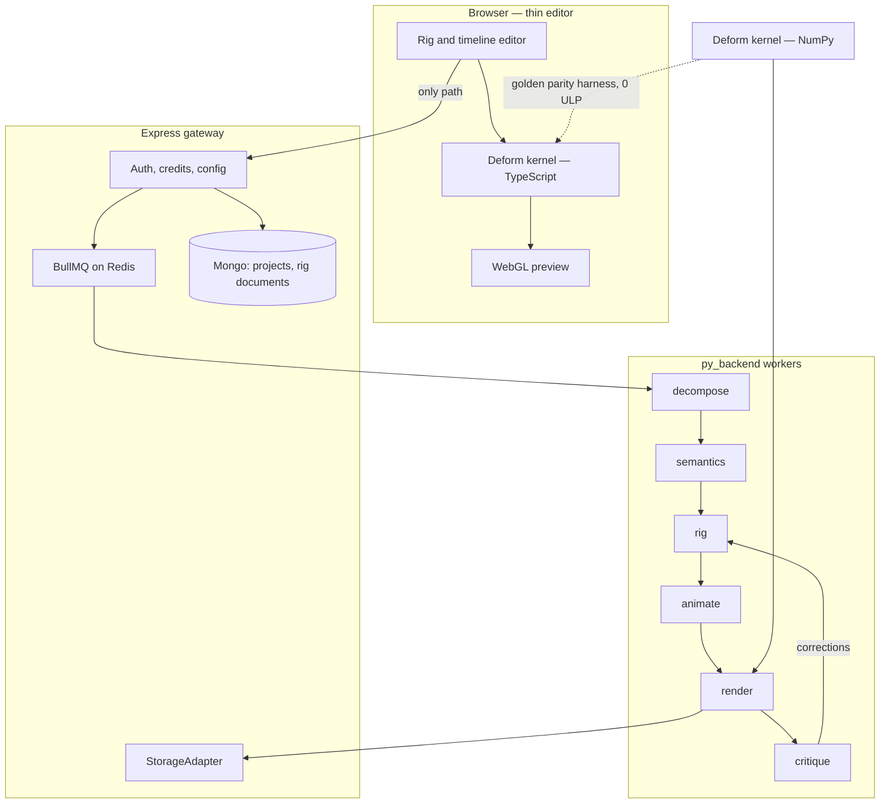

# F9 — AniBuddy v4: layered cutout rig, Python-authoritative

Status: approved plan (2026-08-13). This file is the contract every
implementation order reads, the way `F9-anibuddy-v3.md` was for v3. It
supersedes both `F9-anibuddy-v3.md` (the browser puppet pipeline) and the v4
atlas workspace that was built on top of it.

**A note on the two version numbers.** The *product* generation is v4. The
*schema* version is **5**, because `ATLAS_PROJECT_SCHEMA_VERSION = 4` was
already spent on the atlas project format then at
`frontend/src/features/anibuddy/atlas/types.ts` (deleted in §15). Sharing a
number with a format that does not round-trip into this one would make the
refusal message on reopen a lie. Everywhere below, "v5" means the schema and
"v4" means the product generation.

---

## 1. Where we started

This was the repo on the day the plan was approved. It is here so a later
reader can see what the rest of the document had to move, not as a description
of the tree today (§5, §8, §15).

- **`py_backend/` contained zero rigging code.** It was a detect / name / crop /
  enhance utility. `requirements.txt` carried `opencv-python-headless` and
  `numpy`; there was no `scipy`, `shapely`, `triangle` or `scikit-image`.
  (`triangle` never landed — Ruppert-on-Qhull did, via `scipy`; see §4.1.)
- **The entire geometry engine was browser TypeScript** — roughly 4,000 lines
  under `frontend/src/features/anibuddy/`, Canvas 2D, on the main thread, with
  no WebGL anywhere. Preview is now WebGL over the TypeScript kernel; derivation
  is Python.
- **Both workspaces were dead.** The v3 `AniBuddyWorkspace` had been orphaned
  since `5a4bae8`; the v4 `AtlasWorkspace` never got a renderer. Both sat
  behind `void children` in `frontend/src/app/(anibuddy)/layout.tsx`. Migration
  deleted them; the layout now gates on `AniBuddyClientConfig.editorEnabled`.
- **Nothing was persisted server-side.** AniBuddy stored projects in IndexedDB
  and localStorage. Python-authoritative geometry made server storage a
  forced move, not a nice-to-have.
- **Billing was wrong in three separate ways.** `allowByok: false` contradicted
  the 402 copy in `openrouter.ts:90`; flat one-credit pricing billed a
  six-round interview at up to 7 credits while a double 2400-token vision call
  billed 1; and `modelId` recorded the model that was *requested*, not the one
  the provider actually served.

The v3 algorithms themselves were good. This document ports them; it does not
re-derive them.

---

## 2. Goals

1. **One animation model that covers six asset archetypes.** Layered cutout:
   decompose a sheet into parts, arrange them in a hierarchical transform tree
   with pivots, draw order and attachment slots, and give each part its own
   deformer. The v3 single-puppet rig and the v4 sprite-swap atlas are both
   degenerate cases of this, and are expressible without a special path.
2. **Python owns all geometry.** Decomposition, triangulation, skinning,
   deformation and encoding run server-side. The browser becomes a thin
   editor: it poses, it previews, it does not derive.
3. **Browser preview and server render agree to the last bit that matters.**
   The deformation math exists twice — NumPy for the render worker, TypeScript
   for the browser — and a committed golden corpus is what holds them together.
   What the user scrubs is what they download. (R4, as landed; the shared Rust
   kernel this goal originally named was cancelled — see §4.)
4. **The model proposes semantics; the pipeline derives geometry.** This is the
   v3 invariant (then `lib/mesh.ts` lines 1–7; file deleted, rule kept) promoted
   to a system-wide rule.
5. **A closed critique loop.** The model looks at frames that were really
   rendered, not at its own plan, and issues bounded corrections under a hard
   pass cap and a hard credit ceiling.
6. **Stay non-generative today, with a seam that is a config flip tomorrow.**

## 3. Non-goals

- **In-app image generation.** R2 stands. AniBuddy writes a prompt; the user
  takes it to an image tool of their choosing. §12 describes the seam that
  makes changing this later a config change rather than a rewrite.
- **3D, bone envelopes, physics simulation, or a soft-body solver.** Four
  deformers, all 2D, all deterministic.
- **A general animation authoring tool.** The timeline exists to correct a
  proposed clip, not to compete with a full DCC package.
- **Backwards compatibility of the on-disk format.** v3 and v4 documents do
  not round-trip; §15 covers what happens to them instead.
- **A strangler-fig migration.** Port, verify against a fixture corpus, then
  delete. Two pipelines coexisting is how a codebase acquires a second dead
  workspace.

---

## 4. Superseded decisions, and why

| v3/v4 decision | Superseded by | Why |
|---|---|---|
| One global mesh over one prepared image (v3 `Rig.mesh`) | Per-part deformer, `Part.deformer` | A single mesh cannot express occlusion. An arm drawn *behind* a torso has to be a separate layer with its own draw order; no amount of cut-line triangulation gets there. |
| Geometry computed in the browser (`lib/{mesh,contour,deform}.ts`) | Python stages; a NumPy kernel and a TypeScript kernel held together by a golden parity harness | Triangulation with quality constraints and weight solves are not main-thread work. *Deriving* geometry moved to Python and stayed there; *evaluating* it still has to happen in both places, because a preview that round-trips to a server is not a preview. |
| Weight matrix columns indexed by global joint order | `DeformerMesh.boneIds`, an explicit ordered column list | With one global mesh, joint order was a workable implicit key. With N parts each skinned to a subset of bones, an implicit key silently reinterprets every matrix the moment the skeleton gains a joint. |
| Inverse-distance^4 skinning weights (`lib/mesh.ts:179`) | Harmonic weights over the cotangent Laplacian | Inverse distance needs cut lines to stop a limb dragging the torso. Harmonic weights respect the shape's interior by construction; cut lines stay, as a user override rather than as the primary mechanism. *(This row said "bounded biharmonic". Harmonic is what shipped — see the row below.)* |
| `cdt2d` triangulation | Ruppert refinement on Qhull | `cdt2d` produces a valid triangulation, not a well-shaped one. Sliver triangles are exactly what the σmax/σmin stretch metric flags at render time. *(This row said `triangle`; see the row below.)* |
| v4 `MotionProgram.tracks` (sprite-swap, visibility, z-order, attachment as separate track types) | `PartPose` channels on a normal keyframe | Four parallel track systems, one interpolation model. Folding them into channels means one timeline, one sampler, one editor. |
| v4 `SpriteRegion.classification` (`kind` + `role` + `characterGroup` + `variant` + `view` + `action` + `frame`) | `Part.role` plus `RigDocument.archetype` | Seven partly-overlapping classification axes were never all populated. One closed role vocabulary scoped by one archetype is what the priors actually consume. |
| Browser-side `rigInvalidReason` as the export gate | `Diagnostics.blockingReason`, authored server-side | A client-side gate is advice. The same checks now run in the Python validator, so a hand-crafted request cannot talk its way past them. |
| `PROJECT_SCHEMA_VERSION = 3`, `ATLAS_PROJECT_SCHEMA_VERSION = 4` | `RigDocument.schemaVersion = 5` | One document, one version line. |

**Kept from v3, deliberately:** normalized coordinates; a free-form joint graph
with roles rather than a fixed skeleton; bones derived from the tree and never
stored as objects; the export gate as a *reason string* rather than a boolean;
the σmax/σmin stretch metric; `SEAM_BLEED`; refuse-rather-than-repair on model
output.

**Kept from v4, deliberately:** immutable parent-linked revisions; per-item
provenance and confidence; masks as reversible *descriptions* rather than
baked pixels.

### 4.1 Decisions this document made and the implementation overturned

The rows above record what v5 superseded in v3/v4. These record what the build
superseded in v5, and they are listed rather than quietly edited away because
each was chosen for a reason that turned out to be wrong in a specific way.

| This document originally said | What shipped | Why it changed |
|---|---|---|
| **One Rust crate** compiled to a Python extension and to WASM (§2.3, R4) | **Two kernels** — `py_backend/app/modules/anibuddy/kernel/` in NumPy, `frontend/src/features/anibuddy/kernel/` in TypeScript — with agreement *enforced* rather than *constructed* | A Rust crate adds a toolchain, a build matrix and a `maturin`/`wasm-pack` step to three workspaces that today install with `pnpm` and `pip` alone, in exchange for making one property free. That property turned out to be purchasable directly: `scripts/test-anibuddy-kernel.sh` runs both kernels over 17 committed fixtures and fails above 4 float32 ULP, and the committed result is **0 ULP on every fixture**. Bit-identity was the goal, not the crate. |
| Vertex parity is sufficient to prove the two targets agree | Vertex parity **plus** a second harness over the compositing channels | `visible`, `opacity`, `zIndex` and `swapTo` move no vertex, so the two targets diverged on two of them for months at a reported 0 ULP. `scripts/test-anibuddy-compositing.sh` covers them over 12 goldens. §9.1 and R4. |
| `triangle` with quality constraints | **Ruppert refinement on Qhull** (`rig/triangulate.py`) | `triangle` is not redistributable under a license this project can ship. Qhull is BSD and already a `scipy` dependency, so the refinement is implemented directly on top of it: encroached sub-segment splitting, then skinny-triangle circumcenter insertion under a 20.7° bound. |
| Bounded biharmonic weights | **Harmonic weights over the clamped cotangent Laplacian** (`rig/skin.py`) | BBW minimizes `∫\|Δw\|²` and needs a constrained quadratic program per part to hold `w ∈ [0,1]`. A cotangent Laplacian with non-negative clamped weights is an M-matrix, whose discrete maximum principle bounds the solution in `[0,1]` *without* clamping — one sparse linear solve, no QP, and the boundedness is a theorem rather than a post-step. The cost is first-order rather than second-order smoothness, which is not visible at these mesh densities. |
| `DeformerSpline` stores a bezier `controlPoints` chain, plus `closed` | **Both removed.** The spine is the part's own joint chain; `taper` is a track on `thickness` | A stored polyline has no pose channels, so nothing could animate it — it was authored, never read, and free to drift from the joints that actually drove the render. Reusing the joint chain means a spline is posed by ordinary FK. §9. |

---

## 5. Architecture



The browser never calls `py_backend` directly. Every Python endpoint keeps the
internal-token convention already established in `py_backend/app/main.py`
lines 19–30.

One arrow in that diagram is dashed for a reason. `animate` does not run in
`py_backend` at all: it reasons over ids and a sentence of intent, resamples no
pixel and rebuilds no deformer, so it runs on the `motion-vision` transport —
the gateway's own provider chain via `/api/enhance/anibuddy/motion` — and Node
authors the clip. Giving it a Python endpoint would mean inventing one that
forwards a request it cannot answer. The critique loop is likewise a BullMQ
worker in the gateway (`backend/src/modules/workers/anibuddy.worker.ts`), on its
own queue and its own concurrency, because a loop that spans several stage
executions is not itself a stage. See `AniBuddyConstants.transportByStage`.

The three transports that *do* reach `py_backend` — `decompose`, `rig`,
`render` — are multipart, because each resamples the user's own pixels and the
sheet should ride as bytes rather than as base64 inside a JSON body, which
would inflate it by a third for no gain. **The JSON envelope rides as a FILE
part, not as a form field.** It carries a filename, and that is what makes the
difference: Starlette caps a non-file part at `max_part_size` (1 MB) and raises
`MultiPartException` above it, while a part with a filename is spooled to a
temporary file with no such cap. A rig envelope for a 64-part sheet passes 1 MB
easily, so a form field would work in development and fail on real documents.

---

## 6. Coordinate spaces

Getting this wrong is the class of bug that renders as "the art shears
slightly", so it is stated once and numbered as an invariant (R6).

| Space | Range | Used by |
|---|---|---|
| **Sheet-normalized** | 0..1 of the source sheet's width/height | `Part.rect`, `Joint.x`/`Joint.y` |
| **Part-local normalized** | 0..1 of `Part.rect` | `Part.pivot`, `Slot.position`, every deformer payload, mask polygons, cut lines |
| **Source pixels** | integers | `MaskRle.origin`, `MaskRle.width`/`height`, `AssetRef.width`/`height` |
| **Figure-height fractions** | −1..1 | `JointPose.tx`/`ty`, `PartPose.tx`/`ty` |

Part-local is the change from v3, and it is what makes a part portable: a
re-crop of the sheet moves `Part.rect` and leaves every vertex, control point
and cut line untouched.

The denominator of the fourth row is **`AssetRef.figureHeight`**, falling back
to `asset.height` when it is null (§7.3) — the height of the subject, not of
the canvas, so that a clip reads identically on a tight and a loose crop.

`DeformerSpline.thickness` is the one payload that is normalized against
neither the sheet nor the figure: it is a half-width against the **geometric
mean of `Part.rect`'s pixel dimensions**. A single scalar cannot be exact in an
anisotropic part-local space, so the axis is declared rather than inferred, and
the geometric mean is the only choice that does not silently assume the ribbon
runs horizontally or vertically. The two rig adapters —
`py_backend/.../render/adapter.py` and
`frontend/src/features/anibuddy/editor/rig-adapter.ts` — convert it to the
kernel's full-width-over-figure-height form with the same expression, and are
commented on both sides that they must not drift.

Rotation is applied in **source pixels**, never in normalized space. Rotating
in normalized space shears the figure whenever the sheet is not square — the
reason `lib/deform.ts:68` says so in a comment.

---

## 7. RigDocument v5, field by field

Canonical source: **`schemas/anibuddy/rig-document.v5.schema.json`**. Every
binding in the repo is generated from it (§13). What follows is the reading
guide, not a second copy — where the two disagree, the JSON Schema wins.

### 7.1 Top level

| Field | Type | Meaning |
|---|---|---|
| `schemaVersion` | `5` | Const. A document with any other value is refused by name, not coerced. |
| `id` | string | This revision's id. |
| `projectId` | string | Groups the revisions of one asset. |
| `createdAt` / `updatedAt` | ISO 8601 | |
| `revision` | `RevisionLink` | Immutable parent-linked chain. |
| `archetype` | `Archetype` | Which rig prior applies (§10). |
| `asset` | `AssetRef` | The source sheet, referenced and never edited. |
| `parts[]` | `Part[]` | The cutout layers. `MAX_PARTS` 64. |
| `skeleton` | `Skeleton` | The joint graph. `MAX_JOINTS` 96. |
| `clips[]` | `Clip[]` | Named motions. `MAX_CLIPS` 16. |
| `generation` | `GenerationSeam` | Where the pixels came from (§12). |
| `provenance` | `DocumentProvenance` | Pipeline and kernel versions, plus a `StageRecord` per stage execution. |
| `diagnostics` | `Diagnostics` | What the pipeline measured, including the export gate. |

### 7.2 `RevisionLink`

`{ index, parentRevisionId, reason, accepted }`. A stage never mutates a
document in place; it writes a child revision. Two consequences worth naming:
every correction is reversible, and the editor can diff pass N against pass
N−1 to show the user what the critique actually changed. `accepted: false`
means "this is a proposal", and the UI must render it as one.

### 7.3 `AssetRef`

`{ id, name, storageKey, contentHash, width, height, figureHeight, mimeType,
rightsConfirmed, remoteVisionConsented }`.

- `storageKey` is a key into the existing `backend/src/lib/storage/` adapter.
  The browser never receives a raw provider URL for a private sheet.
- `contentHash` is SHA-256 of the source bytes. Every stage is idempotent on
  it, which is what makes the render cache safe to trust.
- `remoteVisionConsented: false` blocks `semantics`, `animate` and `critique`.
  It does **not** block `decompose`, `rig` or `render` — those are local
  geometry and the user has consented to nothing by uploading.
- **`figureHeight`**, `number | null`, source pixels. The height of the
  *subject* inside the sheet, as distinct from `height`, which is the height of
  the sheet.

**Why `figureHeight` is a field and not a lookup of `height`.** It is the
denominator for `JointPose.tx`/`ty`, `PartPose.tx`/`ty` and
`DeformerSpline.thickness` — the figure-height fractions of §6. Those channels
are figure-relative so that a clip reads identically on a tight crop and on a
loose one: "lift the hand by a fifth of the character" has to mean the same
motion on both, and it does not if the denominator is the canvas. The two
numbers differ whenever the artwork does not fill its sheet, which is the
common case, so resolving `figureHeight` to `height` would defeat the only
reason the channel is figure-relative in the first place.

**Derivation.** The pixel height of the union of every `Part.rect` — the
bounding box of the decomposed figure — measured **once by `decompose`**, the
first stage that knows what the parts are, and carried forward unchanged by
every later revision. It is deliberately *not* re-measured per stage: a `rig`
stage that merged two parts, or a user who deleted one, would otherwise shift
the denominator and silently re-time every clip already authored against it.

**Consumer rule.** `null` means *unmeasured* — a sheet uploaded but not yet
decomposed — and a consumer **MUST** then fall back to `asset.height`. Null and
`height` are therefore the same arithmetic, which is what makes adding the
measurement to an existing document a refinement rather than a migration.

### 7.4 `Part`

The unit of decomposition, draw order, attachment and deformation.

| Field | Notes |
|---|---|
| `id` | `^[A-Za-z0-9_-]{1,32}$`. Stable across revisions — corrections reference it. |
| `name` | Display label. |
| `role` | `PartRole`, a closed 58-entry vocabulary spanning all six archetypes. Selects the default deformer and the motion priors. |
| `mask` | Tagged union: `rect` \| `alpha-threshold` \| `polygon` \| `rle`. Always a reversible *description*; the source sheet is never edited. |
| `rect` | Sheet-normalized bounding box. Defines the part-local space. |
| `pivot` | Part-local. A hip is near `(0.5, 0.1)`; a wheel is at its axle. |
| `zIndex` | Draw order, low first. The **rest value** of the `PartPose.zIndex` channel. |
| `parentPartId` | Transform parent, or `null` for a root part. Acyclic, `MAX_PART_DEPTH` 8. |
| `attachSlot` | Name of a `Slot` on the parent, or `null` to hang from the parent's pivot. |
| `slots[]` | Named attachment points this part *offers*. A sword moves from hand to back without either part learning the other's geometry. |
| `deformer` | Tagged union of the four kinds (§9). |
| `boundJointId` | For a rigid part, the joint that drives it. `null` for a mesh part, which is driven by its weight matrix. |
| `visible`, `opacity` | Rest values for their pose channels. **Nothing multiplies** — see §7.7. |
| `confidence` | Below `CONFIDENCE_REVIEW_FLOOR` (0.55) the editor marks the part as needing review rather than silently trusting it. |
| `provenance` | Which stage or actor produced it: `alpha-component`, `gutter-grid`, `watershed`, `grabcut`, `vision`, `manual`, `imported-v3`, `imported-v4`. |

### 7.5 `Joint` and `Skeleton`

Kept from v3 nearly verbatim. Two changes:

- **`partId`** — joints now bind to a part rather than to one global mesh.
  `null` for a purely structural joint such as the root.
- **`ikChainLength`** — how many ancestors an IK drag may rotate, or `null` for
  FK only. Set by the archetype prior on `limbTip` roles, so dragging a hand
  bends the elbow instead of translating the whole arm.

`JointRole`'s first thirteen entries are the v3 set verbatim and in order, so a
v3 joint graph imports with no remapping. The eleven additions
(`neck`, `digit`, `fin`, `horn`, `tentacleSegment`, `hinge`, `wheel`, `piston`,
`slider`, `layer`, `anchor`) cover the five non-humanoid archetypes.

Invariants carried from v3, now enforced by the Python validator:
exactly one root; every `parent` resolves; no cycles; depth ≤ `MAX_JOINT_DEPTH`;
unique ids; coordinates finite and inside `[0,1]`.

**Bones remain derived**, in stable joint order, and are never stored as
objects. Only their ids appear, as `DeformerMesh.boneIds`.

### 7.6 `NumericBuffer`

Every flat numeric payload — vertices, triangles, weights, control points,
RLE runs, cut-line polylines — is a `NumericBuffer`:

```
{ dtype: "f32" | "u32",
  storage: "inline" | "external",
  length,           // elements, not bytes
  sha256,           // over the little-endian bytes
  values,           // present exactly when storage is "inline"
  storageKey }      // present exactly when storage is "external"
```

This exists because a 1200-vertex weight matrix per part across 64 parts does
not fit a 16MB Mongo document. Anything over
`MAX_INLINE_BUFFER_ELEMENTS` (4096) is written through the `StorageAdapter`
and referenced. `sha256` is what makes render caching and the kernel's
cross-target fixture corpus possible.

### 7.7 `Clip`, `Keyframe`, `JointPose`, `PartPose`

`Clip` is `{ id, name, request, loop, fps, frameCount, keyframes[], source }`.
`fps` and `frameCount` are the clip's *sampling rate*, not its content — the
same framing v3 used.

A `Keyframe` is `{ t, ease, joints: Record<jointId, JointPose>,
parts: Record<partId, PartPose> }`.

**Sparsity is load-bearing.** Every channel is optional, and absent means
"unchanged from rest". A key that mentions only the tail must not snap every
other joint. Interpolation is per-channel between the two bracketing keys; a
channel present in only one of them blends against its rest value — 0 for
`rot`/`tx`/`ty`, 1 for `scale`/`opacity`. `ease` is read from the *earlier*
key: `ease` → smoothstep `u*u*(3-2*u)`, `linear` → `u`, `hold` → `0`.

`JointPose` has `rot`, `tx`, `ty`, `scale`. `PartPose` has those four plus
`visible`, `opacity`, `zIndex` and `swapTo`. The last four are what absorb the
v4 track types. `visible`, `zIndex` and `swapTo` **step**; they never
interpolate, because there is no meaningful halfway between two sprites.

**`Part.visible`/`opacity`/`zIndex` are rest values, and nothing multiplies
them.** A channel no key mentions resolves to the part's authored value; a
channel some key mentions resolves to the sampled value and the authored one
takes no further part. This is stated flatly because the alternative is
tempting and was in fact shipped on the server for months: it multiplied
resolved opacity by `Part.opacity`, so a part authored at 0.5 under a clip
keying 0.5 rendered at 0.25 there and 0.5 in the browser. The one-sided case is
the only place the rest value re-enters — a key on one side of the interval and
nothing on the other blends against rest, as every other channel does.

**`swapTo` substitutes PIXELS ONLY.** It names another part whose *source
pixels* are drawn in place of this one's; the referring part keeps its own
geometry, deformer, parent chain, pivot and draw order. A whole-part
substitution is the other tempting reading, and it was the second half of the
same months-long divergence. An unresolvable `swapTo` warns and the part draws
itself — it is a wardrobe change, not a structural edit, so it must never be
able to fail into a missing limb.

Neither of those two rules moves a vertex, which is why neither harness in §9.1
can be dropped in favour of the other.

### 7.8 `Diagnostics`

Server-authoritative. Authored only by the Python validator — never by the
browser, never by a model.

`blockingReason` is the export gate and the direct descendant of v3's
`rigInvalidReason`: `null` means the document is structurally valid and may be
rendered or exported; a non-null value is a user-facing sentence explaining the
lock. Keeping it a sentence rather than a boolean is what let v3's UI explain
*why* export was disabled, and that stays.

`maxStretch` and `flippedTriangles` carry forward the σmax/σmin metric from
`lib/deform.ts:236-262` verbatim in meaning. `isolatedVertices` promotes the
`console.warn` at `lib/mesh.ts:230` into a real field — a count of vertices a
cut line severed from every bone, which fell back to nearest-bone.

### 7.9 `DocumentProvenance` and `StageRecord`

One `StageRecord` per stage execution: `{ stage, status, startedAt,
finishedAt, inputHash, passIndex, modelId, usageEventId, creditsSpent,
message }`.

`inputHash` is SHA-256 of the stage's canonicalized input; an equal hash lets
the worker return the cached artifact rather than recomputing. `modelId` is
the model that was actually **served** — threaded back from the provider's
response tag, not the one that was requested (§11). `usageEventId` links the
work to the credit event, which is what makes a bill defensible.

---

## 8. The six pipeline stages

Each is an idempotent BullMQ worker keyed by `inputHash`, writes a child
revision, and appends a `StageRecord`.

### 8.1 `decompose`

**In:** `AssetRef`. **Out:** `parts[]` with `mask`, `rect`, provisional
`zIndex`, `confidence`, `provenance`. No roles, no skeleton, no deformers.

Escalating strategy, cheapest first:

1. **Alpha connected components** — port from `atlas/extract.ts`. Clean
   separations, `confidence` high.
2. **Gutter-grid detection** — also from `atlas/extract.ts`. Regular sprite
   sheets, `confidence` high.
3. **`cv2.watershed`** — parts that touch. `confidence` medium.
4. **`cv2.grabCut`** — parts that overlap or share a silhouette.
   `confidence` low, and the editor flags them.

Emits `foregroundPixels` and `coveredForegroundPixels` so the stage grades its
own work; a large gap means the sheet defeated all four strategies.

**Failure modes.** Zero foreground → refuse, "This image has no opaque
pixels." One component covering the whole sheet → single-part degenerate rig,
which is exactly v3's model and is a valid outcome, not an error. More than
`MAX_PARTS` candidates → keep the 64 largest by area, warn, and let the user
merge. Never edit source pixels; every mask stays reversible.

### 8.2 `semantics`

**In:** the sheet annotated with numbered part outlines, plus the part list.
**Out:** `SemanticsProposal` — `archetype`, and per part `role`,
`parentPartId`, `attachSlot`, `pivotHint`, `zIndex`, `deformerHint`,
`confidence`; plus proposed joints.

This is the only place the vision model touches structure, and the schema is
built so it *cannot* emit geometry: there is no vertex, triangle, weight or
mask field anywhere on a proposal (R3). `pivotHint` is a hint — the rig stage
snaps it to the mask's medial axis.

Reuses the pattern the v3 `rig-analysis` route proved, now living at
`frontend/src/app/api/enhance/anibuddy/semantics/route.ts`: strict response
schema, server-side revalidation, one retry carrying the rejection reason.

**Failure modes.** Unknown part id, unknown role, cycle in `parentPartId`,
more than one root, or a joint landing on transparent pixels → reject the
whole response and retry once with the reason (R7). Second failure → refund,
fall back to a geometric prior (largest part is root, others parented by
overlap, all deformers `rigid`), and mark every part
`provenance: "alpha-component"` with low confidence so the editor asks the
user. `remoteVisionConsented: false` → skip straight to the geometric prior
without spending anything.

### 8.3 `rig`

**In:** parts with roles. **Out:** the skeleton plus one deformer per part.

Skeleton inference binds joints to parts. Mesh deformers follow the v3 path,
ported: contour trace → RDP simplify → distance transform → adaptive Poisson
sampling (`lib/contour.ts`), then Ruppert refinement on Qhull in place of
`cdt2d` (`rig/triangulate.py`), then harmonic weights over the clamped
cotangent Laplacian (`rig/skin.py`). The cut-line occlusion logic from
`lib/mesh.ts:193-224` is preserved: a vertex's distance to a bone is infinite
when the straight segment to the bone's nearest point crosses a cut, and a
vertex severed from *every* bone falls back to nearest-bone rather than
propagating a NaN row.

**Failure modes.** Triangulation over `MAX_VERTS_PER_PART` → raise the
sampling spacing and re-run; never truncate the vertex array, which orphans
triangle indices. Degenerate mask (area under `MIN_TRIANGLE_AREA`) → downgrade
that part to `rigid` and warn. Weight row not summing to 1 within
`WEIGHT_ROW_EPSILON` → set `blockingReason`; the document is not renderable.

### 8.4 `animate`

**In:** the built rig's real part and joint ids, plus the user's request.
**Out:** `MotionProposal` — bounded keyframes.

**This stage does not run in `py_backend`.** It rides the `motion-vision`
transport — the gateway's own provider chain at
`/api/enhance/anibuddy/motion` — because it resamples no pixel and rebuilds no
deformer, so a Python endpoint for it would only forward a request it cannot
answer. Node authors the clip. It is still a normal queued stage with a normal
`StageRecord`; only the transport differs, and the difference is declared in
one table (`AniBuddyConstants.transportByStage`) rather than branched on.

**Failure modes.** Unknown id, `t` outside `[0,1]`, first key not at `t = 0`,
non-increasing `t`, or fewer than two usable keys → reject the whole response
and refund (R7). A partially-applied clip is worse than no clip, because it
looks deliberate.

### 8.5 `render`

**In:** rig + clip + output format. **Out:** artifact in storage, keyed by
content hash.

The NumPy kernel deforms; Python rasterizes with NumPy/Pillow and encodes to
PNG zip, GIF, WebM or MP4 through ffmpeg. Rasterization is deliberately *not*
mirrored in the browser — only the vertex math and the compositing resolution
are, because that is where drift actually hurts (R4).

**Failure modes.** `blockingReason` non-null → refuse before spending a frame.
`maxStretch` above `STRETCH_WARNING` (2.5) → render anyway and disclose it,
matching v3's behaviour of showing the problem rather than hiding it. ffmpeg
missing or failing → fall back to the PNG zip, which needs no encoder.

### 8.6 `critique`

**In:** a contact sheet of `CRITIQUE_CONTACT_SHEET_FRAMES` (9) really-rendered
frames. **Out:** `CritiqueReport`. Contract in §11.

Unlike the five above, the critique *loop* is not a stage worker. It is its own
BullMQ worker on its own queue and its own concurrency
(`backend/src/modules/workers/anibuddy.worker.ts`, `Config.anibuddy.critiqueConcurrency`),
because a loop that drives several stage executions to a stopping condition is
not itself one of them. A non-converging loop completes **successfully** as far
as BullMQ is concerned — non-convergence is a defined outcome with a best
revision and a stop reason (§11.6), not a job failure to be retried.

---

## 9. The four deformers

One per part, chosen from the part's role by the archetype prior, always
overridable by the user.

**The part transform tree composes OUTSIDE the deformer.** For a part `P`:

```
dst      = World(P) · Deformer(P, skeleton)
World(P) = World(parent(P)) · Local(P)      , when a parent exists
         = Local(P)                          , for a root part
```

A deformer answers one question — where this part's own pixels land given the
skeleton — and knows nothing about its parents. The tree answers the other, and
knows nothing about deformer kinds. Keeping them separate is what lets all four
kinds hang anywhere in the tree without a matrix of special cases, and it is
why `15-part-tree-over-all-deformers.json` is a fixture: one rig, one tree,
every deformer under it.

**A slot re-anchors, parenting alone carries.** Naming `attachSlot` moves the
child's pivot onto the named `Slot` on the parent, so pointing a sword at the
hand slot and then at the back slot moves the sword, without either part
storing the other's coordinates. Re-anchoring is the *only* thing a slot does.
`attachSlot: null` therefore keeps the child exactly where the artist drew it
and merely carries it under the parent's transform. Both halves are asserted in
one controlled fixture, `13-attach-slot-reanchor.json`.

### `rigid`

**Stores:** nothing but its tag. **Evaluates:** the part is drawn under the
transform of `Part.boundJointId`, composed up the part tree.

**Chosen when** the artwork is drawn as a solid object that should never bend:
a wheel, a shield, a helmet, a UI badge, a hard mechanical panel. It is also
the safe downgrade target when any other builder fails, which matters — a
rigid part looks stiff, and stiff is recoverable; a broken mesh part looks
like corruption.

### `mesh`

**Stores:** `verts` (f32, part-local), `tris` (u32), `boneIds` (ordered weight
columns), `weights` (f32, row-major `vertCount × boneIds.length`), and
`cuts[]`.

**Evaluates:** FK over the joint tree, then linear blend skinning
`v' = Σ_j w_j · (P_j · B_j⁻¹) · v`, then a per-triangle affine warp
`A = D · S⁻¹` of the source pixels. Bone lengths are preserved, so each bone
transform is a pure rotate-about-rest-origin plus a translation. Destination
triangles are pushed out `SEAM_BLEED_PX` (0.5) about their centroid before
clipping, which is what closes the hairline antialiasing gaps between adjacent
clipped triangles.

**Chosen when** the part is soft and skeletally driven: a torso, a limb, a
head, a creature's body. This is the v3 path, now scoped to one part.

**`boneIds` IS the column order of `weights`** — column `c` is the influence of
`boneIds[c]`, and that is a contract rather than a hint. Bones are still derived
from the joint tree and never stored as objects; what is stored is the *order*,
because that is the only part of the derivation the document cannot reconstruct
once the skeleton has moved on. A consumer **MUST permute by name** into its own
derived bone order and must never assume its own column `c` matches. A name its
derivation does not produce **MUST be refused** — never dropped, never skipped.
Dropping a column shifts every later one by one and rebinds every vertex that
used it to a neighbouring bone, which renders as a plausible figure with one
limb driven by the wrong joint. This field is the difference between that
failure being loud and being invisible.

### `lattice`

**Stores:** `cols`, `rows`, `controlPoints` (f32, `(cols+1)·(rows+1)` points,
part-local normalized, **absolute positions** in row-major order — index
`j · (cols+1) + i`), and `interpolation` (`bilinear` | `bicubic`).

Absolute rather than displacements-from-rest is the canonical form and
consumers must keep it. It is what an editor drags and what the rig stage
authors, and the rest grid a displacement form would be differenced against
(exactly uniform over `Part.rect`, so control point `(i, j)` rests at
`(i/cols, j/rows)`) is a reconstruction each consumer would otherwise have to
perform identically. Two reconstructions of one grid is two chances to disagree
about it, in the one place where disagreement reads as the artwork shearing at
rest. The kernels originally took the displacement form and were moved to the
schema's.

**Evaluates:** each source pixel maps to a cell and a local `(u, v)`; the
deformed position is the interpolation of the four (bilinear) or sixteen
(bicubic) surrounding control points.

**Chosen when** the part is a soft sheet with no skeleton of its own: a cape,
hair, cloth, a flag, a parallax layer that should billow. A skeleton would be a
fiction here, and fictional bones are what produce the "why is my cape hinged
at the shoulder" result.

### `spline`

**Stores:** `thickness` (a taper track) and `samples`. That is all.

**`controlPoints` and `closed` were removed from the schema.** An earlier draft
stored a cubic bezier chain here. Nothing could pose it — a static polyline has
no channels — so it was authored, never read, and free to drift from the joints
that actually drove the render. `closed` went with it: a closed ribbon is not a
tail, and no archetype prior ever selected one.

**The spine is the part's joint chain**, and that is the whole design. A tail
needs a joint chain to be posable at all, so reusing it as the spline's control
polyline means the spline is animated by ordinary forward kinematics and needs
no deformer-specific animation channels. The chain derivation, which every
consumer **MUST** implement identically: take the joints whose `partId` is this
part; the head is the one whose `parent` is not itself a member of that set;
follow child links from the head until no member remains. Order is load-bearing
rather than cosmetic — the ribbon's shape *is* the sequence of its control
points, and a reordered chain produces a ribbon folded back on itself. Fewer
than two resolvable joints means the part cannot be splined and **must** be
downgraded to `rigid` with a stated reason, never rendered as an empty ribbon.

**`thickness` is a taper track indexed by normalized position along the
spine**, not by joint: with `m` entries, the half-width at curve parameter `u`
is the track linearly sampled at `u · (m − 1)`. Decoupling the track's length
from the chain's is what lets a chain shortened by the joint budget still taper
over its whole length, and `m = 1` is a legitimate uniform ribbon rather than a
special case. Each entry is normalized against the geometric mean of
`Part.rect`'s pixel dimensions (§6).

**Evaluates:** the chain is sampled at `samples` points into a ribbon — two
vertices per sample, offset along the curve normal by half the local thickness,
two triangles per segment. Source vertices come from running the *identical*
evaluation over the rest chain, which is what makes the artwork slide **along**
the curve instead of swimming across it.

**Chosen when** the part is long, tapering and bends along its length: a tail,
a tentacle, a rope, a hose, a smoke trail. A mesh would need a bone chain the
artwork does not have; a lattice would not follow the curve.

`samples` is stored in the document rather than picked per renderer,
specifically so the browser and the server sample the same curve at the same
points (R4). Samples are spaced uniformly in **parameter**, not in arc length:
an arc-length reparameterization needs an iterative solve whose convergence
path is one more thing two languages would have to reproduce identically.

### 9.1 How the two kernels are held together

R4 originally bought agreement by construction, with one Rust crate. It is
bought by enforcement instead (§4.1), which means the enforcement is now
load-bearing and gets described here rather than assumed.

| Harness | Corpus | Compares | Budget |
|---|---|---|---|
| `scripts/test-anibuddy-kernel.sh` | `fixtures/anibuddy-kernel/`, **17** cases | Posed **vertices** — FK, LBS, lattice, spline, the part tree, clip sampling | 4 float32 ULP; **committed at 0** |
| `scripts/test-anibuddy-compositing.sh` | `fixtures/anibuddy-compositing/`, **12** goldens | The four **compositing** channels — `visible`, `opacity`, `zIndex`, `swapTo` | Exact |

Each runs the Python side against the committed goldens *plus* hand-derived
analytic tests, then the TypeScript side against the same goldens. The analytic
half is not redundant: a golden comparison alone rubber-stamps a
*shared* misunderstanding, since the goldens are generated from one of the two
implementations.

**Neither harness subsumes the other, and this is the important part.** The
kernel harness compares vertices, and none of the four compositing channels
moves one. The two targets can therefore disagree about which layers draw, in
what order, how strongly and out of whose pixels while the kernel harness
reports 0 ULP across all seventeen fixtures. They did, on two counts, for
months — the `Part.opacity` multiply and the whole-part `swapTo`, both now
written down as rules in §7.7. A failure in either harness means the preview
and the export disagree with nothing else failing anywhere: treat it as a
release blocker, and do not widen the tolerance or regenerate the goldens to
clear it.

One asymmetry is deliberate. The compositing job also runs
`python -m tools.gen_compositing_goldens --check`, byte for byte; the kernel job
does **not** run its equivalent. The kernel goldens are generated on one machine
and CI runs on another, and `math.sin` resolves to the platform libm, so a
cross-platform last-bit difference there is not a defect — and a red build with
no defect behind it teaches people to loosen the things that matter.

---

## 10. The six archetypes and their rig priors

Priors are **data**, not architecture. Each is a role vocabulary, an expected
joint topology, and a role → default-deformer table. Adding an archetype adds
a table; it does not add a code path.

### 10.1 Humanoid

Roles: `head`, `face`, `hair`, `torso`, `pelvis`, `armUpper`, `armLower`,
`hand`, `legUpper`, `legLower`, `foot`, `eye`, `jaw`, `ear`, `cape`,
`accessory`.

Topology: `root` → `pelvis` → `spine` → `neck` → `head`; four limb chains
`limbUpper` → `limbLower` → `limbTip`, with `ikChainLength: 2` on the tips.

| Role | Default deformer |
|---|---|
| `torso`, `pelvis`, `armUpper`, `armLower`, `legUpper`, `legLower`, `head` | `mesh` |
| `hand`, `foot`, `eye`, `jaw`, `accessory` | `rigid` |
| `hair`, `cape` | `lattice` |

### 10.2 Creature / quadruped

Roles: humanoid's, plus `neck`, `tail`, `wing`, `fin`, `horn`, `paw`, `snout`,
`shell`, `tentacle`.

Topology: `root` → `spine` chain of 3–6 segments; four limb chains hanging off
the front and rear of the spine; `tail` and `neck` as their own chains. A snake
gets a spine chain and no limbs — the case v3's fixed skeleton could never
represent.

| Role | Default deformer |
|---|---|
| `torso`, `neck`, `legUpper`, `legLower`, `wing`, `fin` | `mesh` |
| `paw`, `horn`, `shell`, `snout` | `rigid` |
| `tail`, `tentacle` | `spline` |
| `hair` | `lattice` |

### 10.3 Mechanical / vehicle

Roles: `chassis`, `wheel`, `track`, `turret`, `barrel`, `piston`, `hatch`,
`rotor`, `thruster`, `antenna`.

Topology: `chassis` as root, everything else a single-level child with a
`hinge`, `wheel`, `piston` or `slider` joint. Depth is shallow by nature.

| Role | Default deformer |
|---|---|
| `chassis`, `wheel`, `turret`, `barrel`, `hatch`, `rotor`, `thruster` | `rigid` |
| `track` | `lattice` |
| `antenna` | `spline` |
| `piston` | `rigid`, driven by a `slider` joint |

Rigid dominates here, and that is correct: bending a wheel is a bug, not a
feature.

### 10.4 Prop / VFX

Roles: `prop`, `weapon`, `projectile`, `effect`, `spark`, `smoke`, `trail`.

Topology: usually a single part, or a small flat set with no skeleton at all.
This is the archetype where `skeleton.joints` is legitimately empty
(`MIN_JOINTS` is 0), and motion lives entirely in `PartPose` channels.

| Role | Default deformer |
|---|---|
| `prop`, `weapon`, `projectile` | `rigid` |
| `effect`, `spark` | `rigid` with `visible`/`opacity`/`swapTo` keys |
| `smoke`, `trail` | `spline` |

### 10.5 Environment parallax

Roles: `skyLayer`, `backgroundLayer`, `midgroundLayer`, `foregroundLayer`,
`cloud`, `foliage`, `waterLayer`.

Topology: flat. Every layer is a root part with a distinct `zIndex`; motion is
`tx` at a per-layer rate. Joints, where present, are `layer` role and exist
only to give a layer a translation handle.

| Role | Default deformer |
|---|---|
| `skyLayer`, `backgroundLayer`, `midgroundLayer`, `foregroundLayer` | `rigid` |
| `cloud` | `rigid` |
| `foliage`, `waterLayer` | `lattice` |

### 10.6 UI / logo motion

Roles: `logoMark`, `logoText`, `icon`, `badge`, `panel`, `glyph`, `underlay`.

Topology: shallow tree with `anchor` joints. The prior favours short clips with
`hold` easing and small `scale`/`opacity` deltas — a logo that squashes like a
character reads as broken.

| Role | Default deformer |
|---|---|
| all seven | `rigid` |

`glyph` may be promoted to `mesh` on explicit user request, and nothing else
here should be.

---

## 11. The propose-then-critique loop

### 11.1 Shape

```
rig ──▶ animate ──▶ render (contact sheet) ──▶ critique
 ▲                                               │
 └───────────── corrections, pass N+1 ───────────┘
```

The model looks at frames the renderer really produced, not at its own plan.
That is the whole point: a proposal is a hypothesis about pixels the model has
never seen deformed.

### 11.2 Schemas

All three live in the canonical JSON Schema as `$defs`, so every language gets
them from the same generation run:

- `SemanticsProposal` — `{ archetype, parts[], joints[], warnings[] }`
- `MotionProposal` — `{ name, loop, fps, frameCount, keyframes[], warnings[] }`
- `CritiqueReport` — `{ verdict, passIndex, observations[], corrections[] }`

`verdict` is `accept` | `revise` | `abort`.

### 11.3 Corrections are a closed set

A `Correction` is `{ kind, targetId, reason, vec2, scalar, intValue,
deformerKind, stringValue }`. `kind` is one of:

| Kind | Payload | Bound |
|---|---|---|
| `pivot-nudge` | `vec2`, part-local delta | `CRITIQUE_MAX_PIVOT_NUDGE` = 0.08 |
| `rotation-damp` | `scalar` multiplier | ≥ `CRITIQUE_MIN_ROTATION_DAMP` = 0.25 |
| `z-order` | `intValue` | −512..512 |
| `deformer-swap` | `deformerKind` | one of the four |
| `parent-change` | `stringValue`, a part or joint id | must resolve, must not create a cycle |
| `keyframe-retime` | `scalar`, a time in 0..1 | |
| `part-visibility` | `stringValue`, `show` or `hide` | |
| `abort` | none | ends the loop |

Every field is a bounded scalar or an id. **There is no field through which
geometry can enter** — that is the schema-level enforcement of R3, and it is
why the correction set is closed rather than free-form.

### 11.4 Revalidation

Applies to all three proposal types, and is the same rule v3 landed on:

1. Parse. A response that is not valid JSON against the schema is rejected
   whole.
2. Resolve every id against the *current* document. An unknown id rejects the
   whole response — it is a sign the model is working from a stale revision.
3. Clamp every numeric channel to its schema bound. A value outside the bound
   is a rejection, not a clamp, when it is more than 20% outside; inside that
   band it is clamped and warned. The asymmetry is deliberate: a slightly
   out-of-range number is a rounding artifact, a wildly out-of-range one means
   the model misunderstood the units.
4. Re-run the structural validator (single root, acyclic, depth caps).
5. **Refuse rather than repair (R7).** A partially repaired graph produces a
   rig that looks plausible and animates wrongly, which is strictly worse than
   a clean refusal the user can act on.

### 11.5 Retry, pass cap, credit ceiling

- **One retry per call**, carrying the rejection reason back to the model
  (`PROPOSAL_RETRY_LIMIT` = 1). A second failure refunds and falls back.
- **`MAX_CRITIQUE_PASSES` = 3.** Pass 0 is the initial unreviewed rig; passes
  1–3 are critique iterations.
- **`CRITIQUE_CREDIT_CEILING` = 24 credits per project per loop**, checked
  *before* each pass is enqueued. The ceiling is a hard stop independent of the
  pass cap, because a single pass on a 64-part sheet costs more than a pass on
  a 3-part one, and only the ceiling bounds the worst case.

### 11.6 When it cannot converge

Non-convergence is a normal outcome and gets a defined one, not a retry storm:

1. The loop stops at whichever limit is hit first — pass cap, credit ceiling,
   or `verdict: "abort"`.
2. The **best** revision is selected, not the last. "Best" is the lowest
   `maxStretch` among revisions with `flippedTriangles == 0` and
   `blockingReason == null`; if none qualifies, the last revision with a null
   `blockingReason`; if still none, pass 0.
3. That revision is marked `accepted: false` and the unaccepted chain is kept,
   so the user can step through what was tried.
4. `diagnostics.warnings` gains one entry naming the stop condition, and the
   editor opens on the parts with the lowest confidence — the loop's honest
   answer is "here is where I am unsure", not a spinner.

Credits for a pass that was enqueued and completed are **not** refunded; the
work was really done and the frames really exist. Credits for a pass rejected
at revalidation are.

---

## 12. The generation seam

**R2 stands.** AniBuddy writes a prompt; the user takes it to an image tool of
their choosing. Writing a prompt is not generating with one.

Everything about pixel origin is isolated in one object so that changing this
later touches three things and nothing else:

```
generation: {
  mode: "external-prompt-only" | "in-app-generated",
  prompt: string | null,
  transcript: QaTurn[],            // the concept interview, max 6 rounds
  producedBy: { kind, modelId, at } | null
}
```

The three things:

1. `Config.anibuddy.generationEnabled` — a boolean on the frozen config module
   at `backend/src/common/config/config.ts`, `false`.
2. The validator branch that rejects `mode: "in-app-generated"` while that flag
   is false.
3. Moving `anibuddy-generation` from `RESERVED_USAGE_OPS` into
   `REGISTERED_USAGE_OPS` in `backend/src/modules/usage/usage.constants.ts`.
   It is already priced; it is deliberately not accepted.

The enum already carries `in-app-generated` on purpose. Had it not, enabling
generation would be a schema version bump and a migration across three
languages — which is exactly the "rewrite" this seam exists to avoid.

The `R2` test in `backend/src/__tests__/usage.test.ts` stays green throughout,
and the greps from the v3 orders doc stay clean:

```
grep -rn "studio/generate" frontend/src/app/api/enhance/anibuddy/   # no hits
```

---

## 13. Billing

The old `costPerUnit` returned 1 for every non-image op. That charged a
six-round interview up to 7 credits while a double 2400-token vision call on a
64-part contact sheet cost 1. Cost has to track work.

The corrected table lives in
`backend/src/modules/usage/usage.constants.ts` as `UsageConstants.opCreditRates`
— fractional rates against a baseline of one ~700-token text reasoning call =
1 credit, totalled as `ceil(rate × units)` and floored at `minCost`:

| Op | `units` means | Rate | Rationale |
|---|---|---|---|
| `anibuddy-prompt` | interview rounds | 1 | Short text call each. |
| `anibuddy-decompose` | detected parts | 0.25 | CPU-only OpenCV, no model call. |
| `anibuddy-rig` | parts | 0.5 | The `semantics` vision pass **and** deformer construction bill here together — they are one user-visible step and always run as a pair. |
| `anibuddy-animate` | clips | 6 | The most expensive single call: up to two 2400-token vision calls under a 105s budget. |
| `anibuddy-critique` | passes | 3 | One contact-sheet vision call per pass. |
| `anibuddy-render` | frames | 0.25 | Deform, rasterize, encode. |
| `anibuddy-generation` | — | 4, **reserved and unregistered** | §12. |

Two properties worth preserving deliberately:

- **AniBuddy rates avoid 1 / 4 / 10.** Those are the image-model rates, so an
  AniBuddy op that ever leaked into the image branch would be detectable from
  its price alone — which is what keeps the R2 test meaningful rather than
  tautological.
- **The 1–20 `units` clamp stays**, and the rates were chosen to fit inside it:
  64 parts, 120 frames and 3 passes all clamp to at most 20 units, so the
  clamp bounds a tampered client without distorting a legitimate large job.

Two corrections that ship with the table:

1. **Record the served model.** Thread the `X-LLM-Provider` response tag back
   into `consume` so `StageRecord.modelId` and `UsageEvent.modelId` name what
   actually ran, not what was requested.
2. **Resolve the BYOK contradiction.** Either set `allowByok: true` or delete
   the 402 copy at `openrouter.ts:90` that promises it. Ship one, not both.

---

## 14. Schema generation and drift control

All four bindings are **generated from one source**. Route taken, and why.

**Canonical source:** `schemas/anibuddy/rig-document.v5.schema.json`, JSON
Schema draft 2020-12, authored against a deliberately small subset (documented
in the generator header).

**Generator:** `scripts/anibuddy/generate-bindings.mjs`, zero dependencies.

```
pnpm --dir backend schema:anibuddy         # write all four bindings
pnpm --dir backend schema:anibuddy:check   # CI drift gate
```

**Emitted:**

| Target | Path |
|---|---|
| TypeScript types | `frontend/src/features/anibuddy/rig/rig-document.generated.ts` |
| zod DTOs | `backend/src/modules/anibuddy/dto/rig-document.generated.ts` |
| Mongoose schemas | `backend/src/modules/anibuddy/anibuddy.rig-document.generated.model.ts` |
| Pydantic models | `py_backend/app/modules/anibuddy/schemas.py` |

**Why hand-rolled rather than `json-schema-to-typescript` +
`datamodel-code-generator` + a Mongoose generator.** The three workspaces have
three separate dependency stories and no shared install step. A generator that
needs `pnpm install` in two places and `pip install` in a third before CI can
check for drift is a generator CI will end up skipping. This one runs with
`node` and nothing else, which is why the CI job below has no install step at
all. The cost is that the schema must stay inside the supported subset, and
the generator throws rather than guessing when it does not.

**Two extension keywords carry the constants:**

- `x-limit` lifts a real JSON Schema constraint into a named constant, so a cap
  is authored once as a constraint *and* reaches every language as a constant
  (Rule 9). `"maxItems": 64, "x-limit": {"maxItems": "MAX_PARTS"}`.
- `x-constants` holds the invariants that are not per-field constraints —
  tree-depth caps, epsilons, the credit ceiling.

Both land in `ANIBUDDY_LIMITS` in every target. Nothing downstream may
re-declare any of them.

**Drift gate.** `.github/workflows/ci.yml` gains a `schemas` job that
regenerates in memory and fails when any binding on disk differs. A hand edit
to a generated file, or a schema change committed without a regeneration,
fails there. `backend/src/__tests__/anibuddy.schema.test.ts` additionally pins
the contract properties the rest of the pipeline relies on, including the
"a semantics proposal has no geometry channel" assertion for R3.

**What is deliberately *not* generated:** the Mongoose top-level model, the
aggregator index files, and every hand-written DTO envelope. Generating those
would clobber the routing and service code that lands beside them.

**Known limits of the Mongoose projection.** Tagged unions land as
`Schema.Types.Mixed`, because Mongoose can only express a union through a
discriminator model, and that would drag behaviour into a file Rule 10 keeps
pure. Mongo is a storage projection; **zod is the validating boundary**, and
nothing reaches the database without passing it.

---

## 15. Migration — port, then delete

Port to Python, verify against a fixture corpus, then delete. Not a strangler
fig: two live pipelines is how this codebase ended up with two dead workspaces.
The corpus passed; the deletions below are done, not outstanding.

### Deleted once the corpus passed

| File | Ported to |
|---|---|
| `frontend/src/features/anibuddy/lib/mesh.ts` | `py_backend/app/modules/anibuddy/rig/mesh.py` + kernel LBS |
| `frontend/src/features/anibuddy/lib/contour.ts` | `py_backend/app/modules/anibuddy/rig/contour.py` |
| `frontend/src/features/anibuddy/lib/deform.ts` | Both `kernel/`s (FK, LBS, affine warp, stretch metric, seam bleed) |
| `frontend/src/features/anibuddy/lib/skeleton.ts` | `py_backend/app/modules/anibuddy/rig/skeleton.py` |
| `frontend/src/features/anibuddy/lib/clip.ts` | Both `kernel/`s' clip sampler |
| `frontend/src/features/anibuddy/lib/prepare.ts` | `decompose` stage |
| `frontend/src/features/anibuddy/lib/raster.ts` | `render` stage |
| `frontend/src/features/anibuddy/lib/export.ts` | `render` stage encoders |
| `frontend/src/features/anibuddy/lib/manifest.ts` | Server-side project documents |
| `frontend/src/features/anibuddy/lib/project-io.ts` | Server-side project documents |
| `frontend/src/features/anibuddy/types.ts` | `rig/rig-document.generated.ts` |
| `frontend/src/features/anibuddy/atlas/extract.ts` | `decompose` stage |
| `frontend/src/features/anibuddy/atlas/compiler.ts` | `animate` stage |
| `frontend/src/features/anibuddy/atlas/types.ts` | `rig/rig-document.generated.ts` |
| `frontend/src/features/anibuddy/atlas/storage.ts` | `StorageAdapter` |
| `components/{SourceStep,PrepareStep,RigStep,AnimateStep,ExportStep,ConceptStep,StepRail,Timeline,RigCanvas}.tsx` | `editor/` |
| `components/AniBuddyWorkspace.tsx` | `editor/ui/AniBuddyEditor.tsx` |
| `components/AtlasWorkspace.tsx` | — (never had a renderer) |
| `frontend/types/cdt2d.d.ts` + the `cdt2d` dependency | Ruppert-on-Qhull, server-side |
| `frontend/src/app/api/enhance/anibuddy/rig-analysis/route.ts` | `/api/enhance/anibuddy/semantics` |
| `frontend/src/app/api/enhance/anibuddy/animate/route.ts` | `/api/enhance/anibuddy/motion` |

### Frontend keeps

The thin editor. **Not** the v3 step components. Migration deleted
`components/{StepRail,Timeline,RigCanvas}.tsx` with the rest of that tree;
they are not seeds of the new UI and they are not on disk.

What remains under `frontend/src/features/anibuddy/`:

- `editor/` — `RigViewport`, `ClipTimeline`, `StagePanel`, `AniBuddyEditor`
  (plus `Inspector` and `ProjectSetup`)
- `kernel/` — the TypeScript deformation kernel
- the WebGL renderer (`editor/gl-renderer.ts`)
- the API client (`api/anibuddyClient.ts`)

**`/api/enhance/anibuddy/prompt` was kept.** There is no v5 concept-step UI;
the prompt route is the R2 seam (write a prompt, take it to an image tool),
not a leftover interview screen. `semantics`, `motion` and `critique` are the
new enhance routes; `rig-analysis` and `animate` are gone.

The kernel is the one entry here that grew rather than shrank. Under the
original plan the browser kept a thin WASM *binding*; with the crate cancelled
(§4.1) it keeps a full second implementation, which is why §9.1's harnesses are
not optional infrastructure. R5 is unaffected: the browser still evaluates
geometry and never derives it.

### Also

`void children` is gone from `frontend/src/app/(anibuddy)/layout.tsx`. The
layout renders `children` when `AniBuddyClientConfig.editorEnabled` is on
(`NEXT_PUBLIC_ANIBUDDY_EDITOR_ENABLED`) and `ComingSoonPage` otherwise, so
turning the editor on or off is a deploy-time flag rather than a code change.

### Existing user data

v3 localStorage blobs and v4 IndexedDB projects do not round-trip. Both are
refused **by name**, with the reason, in the manner v3's `manifest.ts:80`
already refused a v1 file. `PartProvenance` carries `imported-v3` and
`imported-v4` values so that a best-effort importer — sheet plus rights flag
only, no rig — remains possible later without another schema change.

---

## 16. Invariants

Numbered like `F9-anibuddy-v3-orders.md`. Every order reads these first.

**R1 — the gate stays green between orders.** No order may leave
`pnpm --dir backend typecheck`, `pnpm --dir frontend exec tsc --noEmit`,
`pnpm --dir frontend test`, `python -m unittest discover tests` in
`py_backend`, or either parity harness failing "until a later order fixes it".
See §18.

**R2 — non-generative invariant (F9 §2).** AniBuddy may only ever call text /
vision *reasoning* models. No AniBuddy route may call an image model or
`/api/studio/generate`. Every exported pixel must remain a resampled pixel of
the user's own artwork. If an order tempts you toward image generation, the
order is being misread. *(Verbatim from v3. §12 adds the seam; the seam is
inert while `Config.anibuddy.generationEnabled` is false, and the invariant is
what that flag guards.)*

**R3 — the model proposes semantics, never geometry.** A vision model may
return roles, parentage, pivot *hints*, draw order, deformer *hints* and
keyframes. It may never return vertices, triangles, weights, control points or
masks. This is enforced structurally: no proposal schema has a field capable
of carrying them. Extends the invariant that lived at v3 `lib/mesh.ts`
lines 1–7 (file deleted; the rule did not).

**R4 — two kernels, one behaviour, enforced.** FK, skinning, lattice and spline
evaluation, the affine warp matrices, the clip sampler and the compositing
resolution exist **twice** — NumPy in `py_backend/app/modules/anibuddy/kernel/`,
TypeScript in `frontend/src/features/anibuddy/kernel/`. Fixed evaluation order,
`f32` throughout. Nothing makes them agree by construction, so two committed
golden harnesses make them agree by enforcement: **0 ULP over 17 vertex
fixtures** and exact agreement over **12 compositing goldens** (§9.1). Both are
CI jobs and both are release blockers. Rasterization stays per-target — only
the math is mirrored, because that is where drift is invisible until it is a
support ticket. *(This invariant originally specified one Rust crate compiled
to a Python extension and WASM; §4.1 records why that was cancelled and why the
property it guaranteed survived the cancellation.)*

**R5 — geometry is server-authoritative.** The browser may pose, preview and
edit *parameters*. It may not derive a mesh, solve weights, or author
`Diagnostics`. Anything the browser computes is a preview of a server result,
never the result.

**R6 — coordinate spaces are declared, never inferred.** Sheet-normalized for
`Part.rect` and joint positions; part-local normalized for pivots, slots and
every deformer payload; source pixels for RLE masks; figure-height fractions
for pose translations. Rotation is applied in source pixels. See §6.

**R7 — refuse rather than repair.** When a model response fails structural
validation, reject the whole response and refund. A partially repaired graph
produces a rig that looks plausible and animates wrongly. *(Verbatim from v3.)*

**R8 — masks describe, they never bake.** Every mask is a reversible
description over unmodified source pixels. No stage writes a modified copy of
the user's artwork. This is what lets a user reopen a bad decomposition and
fix it instead of re-uploading.

**R9 — revisions are immutable and parent-linked.** A stage writes a child
revision; it never mutates one in place. Every correction is reversible and
every pass is diffable.

**R10 — one schema source.** `schemas/anibuddy/rig-document.v5.schema.json` is
the only place a RigDocument field is declared. Hand-editing a generated
binding fails CI. Re-declaring a limit that exists in `ANIBUDDY_LIMITS` is a
review rejection.

**R11 — no drive-by refactors.** Touch only files the order names. Match the
surrounding comment density and naming; this codebase documents *why*, not
*what*. *(Carried from v3 R5.)*

**R12 — preserve load-bearing code verbatim where an order says "verbatim".**
Specifically: the LBS skinning loop, the per-triangle affine warp `A = D · S⁻¹`
in canvas order `[a c; b d]`, `SEAM_BLEED`, the closed-form 2×2 singular-value
stretch metering, and the cut-line occlusion test. These were derived
carefully; re-deriving them is how silent visual bugs get introduced.
*(Carried from v3 R6.)*

**R13 — cost tracks work.** Every op's cost is proportional to the parts,
frames or vision calls it really consumed, and every `UsageEvent` records the
model that was **served**. §13.

---

## 17. Sequencing

Vertical slice before breadth. Phase 1 must produce **one humanoid sheet,
decomposed, rigged, posed and rendered end to end** before any second
archetype, any second deformer type, or the critique loop is built. The
remaining five archetypes are role tables and prior data (§10), not new
architecture.

The ordered work breakdown lives in the plan's todo list; this document is the
*what*, that one is the *order of work*.

---

## 18. Verification

**Gates** — these are the CI jobs. A failure in any of them is a red pull
request, not a comment.

```
pnpm --dir backend schema:anibuddy:check
# equivalent, and what the `schemas` job runs (no install):
node scripts/anibuddy/generate-bindings.mjs --check

cd backend  && pnpm typecheck && pnpm test
cd frontend && npx tsc --noEmit && pnpm test
cd py_backend && python -m unittest discover tests
bash ./scripts/test-anibuddy-kernel.sh
bash ./scripts/test-anibuddy-compositing.sh
```

`compileall` on `py_backend/app` still runs in CI as a cheaper parse check
before the unittest suite; it is not a substitute for it.

**Contract checks that must stay green**

1. The R2 non-generative cost test in `backend/src/__tests__/usage.test.ts`.
2. The R3 "a semantics proposal has no geometry channel" test in
   `backend/src/__tests__/anibuddy.schema.test.ts`, plus the frontend
   revalidator corpus (`frontend/src/features/anibuddy/proposal/__tests__/`).
3. The R4 dual-kernel corpus: NumPy and TypeScript agree within 4 float32 ULP
   (committed at 0) over **17** vertex fixtures, and exactly over **12**
   compositing goldens. `bash ./scripts/test-anibuddy-kernel.sh` and
   `bash ./scripts/test-anibuddy-compositing.sh`. There is no Python extension
   and no WASM build — §4.1 cancelled the crate.
4. The drift gate: no binding differs from a fresh generation.
